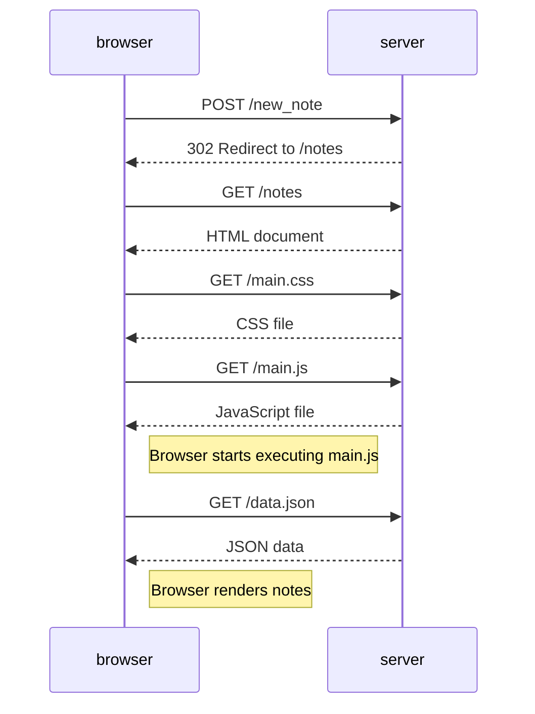

```mermaid
sequenceDiagram
participant browser
participant server

browser->>server: POST /new_note
server-->>browser: 302 Redirect to /notes

browser->>server: GET /notes
server-->>browser: HTML document

browser->>server: GET /main.css
server-->>browser: CSS file

browser->>server: GET /main.js
server-->>browser: JavaScript file

Note right of browser: Browser starts executing main.js

browser->>server: GET /data.json
server-->>browser: JSON data

Note right of browser: Browser renders notes
```
